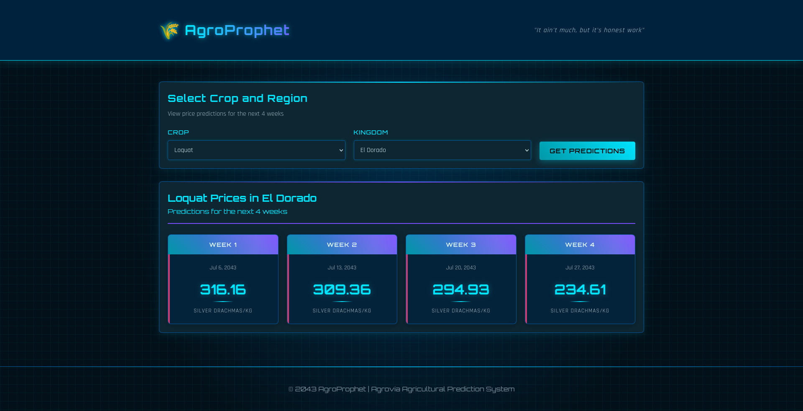
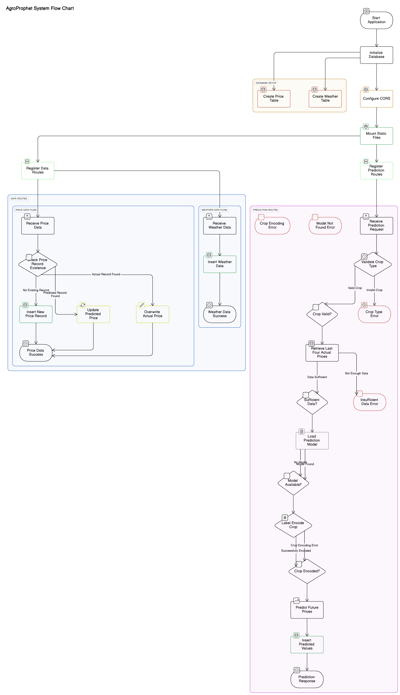
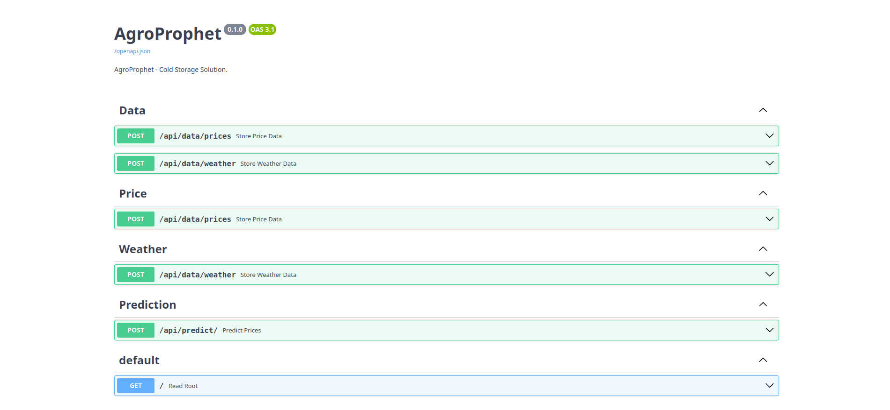

# AgroProphet

Predict the future of your harvest!



## Project Structure 🌲

AgroProphet's codebase is portrayed in the following structure:


```sh
.
├── deployment                      # Deployment folder containing the system
│   ├── models                      # Serialized XGBoost models
│   │   ├── Arcadia__Fruit.joblib     # Example: Arcadia region - Fruit prices
│   │   ├── Arcadia__Vegetable.joblib
│   │   ├── ...                       # (Other similar region/crop models)
│   │   └── Zion__Vegetable.joblib
│   ├── payloads                    # Pydantic schemas for request validation
│   │   ├── __init__.py               # Init file for payloads module
│   │   ├── prediction.py             # Schema for price prediction requests
│   │   ├── price.py                  # Schema for incoming price data
│   │   └── weather.py                # Schema for incoming weather data
│   ├── routes                      # FastAPI route definitions
│   │   ├── __init__.py               # Init file for routes module
│   │   ├── data.py                   # Handles new data submission
│   │   └── prediction.py             # Handles prediction requests
│   ├── static                      # Static files served with the API
│   │   └── index.html                # Basic HTML UI or landing page
│   ├── agroprophet.db             # SQLite database of the system
│   ├── Dockerfile                 # Docker image build configuration
│   ├── main.py                    # FastAPI app entry point
│   ├── requirements.txt           # List of Python dependencies
│   └── settings.py                # Configuration file
├── img                             # Images used in documentation
│   └── ...                         # Flowchart, screenshot, swagger, etc.
├── notebooks                       # Jupyter notebooks
│   └── AgroProphet.ipynb          # Final training and serialization notebook
├── Documentation.pdf              # Project documentation
├── image_name.txt                 # Docker image tag/version info
├── LICENSE                        # Project license file
├── Presentation.pptx              # Project presentation slides
└── README.md                      # Project overview and setup guide

```

## System Architecture 🏛️

AgroProphet's architecture is depicted below:



## Setup (Manual) ⚙️

AgroProphet has very few prerequisites, which are probably already installed on your system:

1. [Git](https://git-scm.com/) version control system (needed to clone the project)
2. [Python](https://www.python.org/) (recommended to have a version greater than 3.9.0)

To run AgroProphet locally on your machine, follow these steps:

### 1. Clone Project


```shell
git clone https://github.com/Caramel-Labs/agroprophet.git
cd agroprophet/deployment
```

### 2. Activate Virtual Environment


```shell
pip install virtualenv
```

To create and activate a virtual environment, enter the following commands after moving into the `agroprophet` folder as done previously:

```shell
# Create a virtual environment named 'env':
python -m venv env

# Activate the virtual environment (Windows):
env\Scripts\activate.bat

# Activate the virtual environment (MacOS / Linux):
source env/bin/activate
```

To deactivate the virtual environment (and remove the `(env)` prefix):

```shell
deactivate
```

### 3. Install Dependencies

After activating the virtual environment, you can install the necessary dependencies:

```shell
pip install -r requirements.txt
```

### 4. Start FastAPI App


```shell
fastapi dev main.py
```

FastAPI will then serve AgroProphet on [http://localhost:8000](http://localhost:8000). Navigate to [http://localhost:8000/docs](http://localhost:8000/docs) to view the SwaggerUI for AgroProphet:



## Setup (via DockerHub) 🐳

AgroProphet is available as a Docker image on DockerHub, so you can skip installing Python or dependencies manually. You'll only need to have Docker installed.

### Prerequisites

- [Docker](https://www.docker.com/products/docker-desktop/) (Ensure it's running)

### 1. Pull the Docker Image

```bash
docker pull caramelabs/agroprophet:latest
```

### 2. Run the Docker Container

```bash
docker run -d -p 8000:8000 caramelabs/agroprophet:latest
```

This runs the app in detached mode (`-d`). You’ll then be able to access the app via:

- [http://localhost:8000](http://localhost:8000)  
- [http://localhost:8000/docs](http://localhost:8000/docs)

To stop the container, find the container ID:

```bash
docker ps
```

Then stop it:

```bash
docker stop <container_id>
```

---

## Setup (Build Locally with Dockerfile) 🛠️

If you prefer to build the image yourself from source, use the included Dockerfile.

### 1. Clone the Repo

```bash
git clone https://github.com/Caramel-Labs/agroprophet.git
cd agroprophet/deployment
```

### 2. Build the Docker Image

```bash
docker build -t agroprophet .
```

This builds a local image named `agroprophet` using the `Dockerfile` in the project root.

### 3. Run the Container

```bash
docker run -d -p 8000:8000 agroprophet
```

You’ll then be able to access the app via:

- [http://localhost:8000](http://localhost:8000)  
- [http://localhost:8000/docs](http://localhost:8000/docs)

---

Made with ❤️ by Caramel Labs
